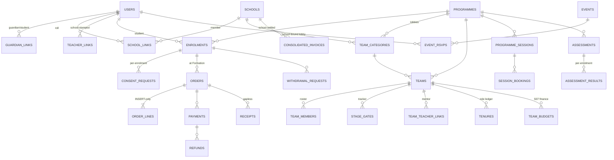
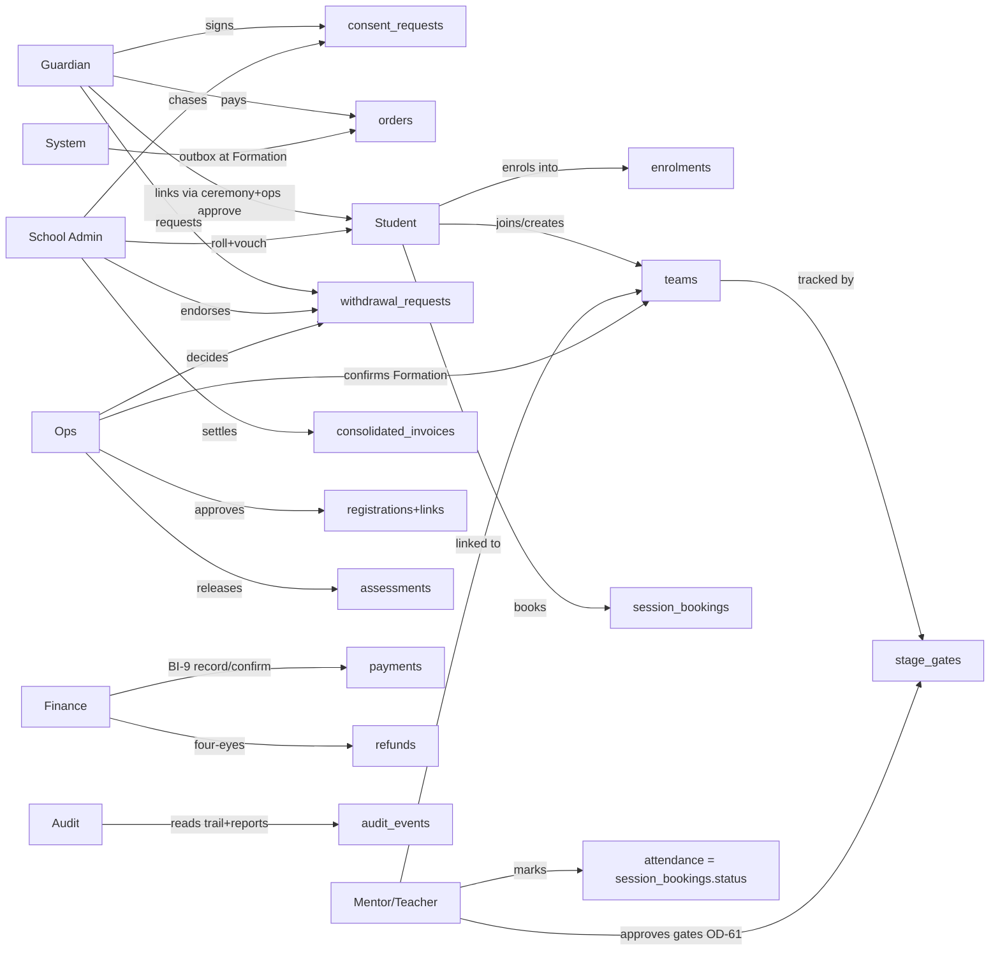
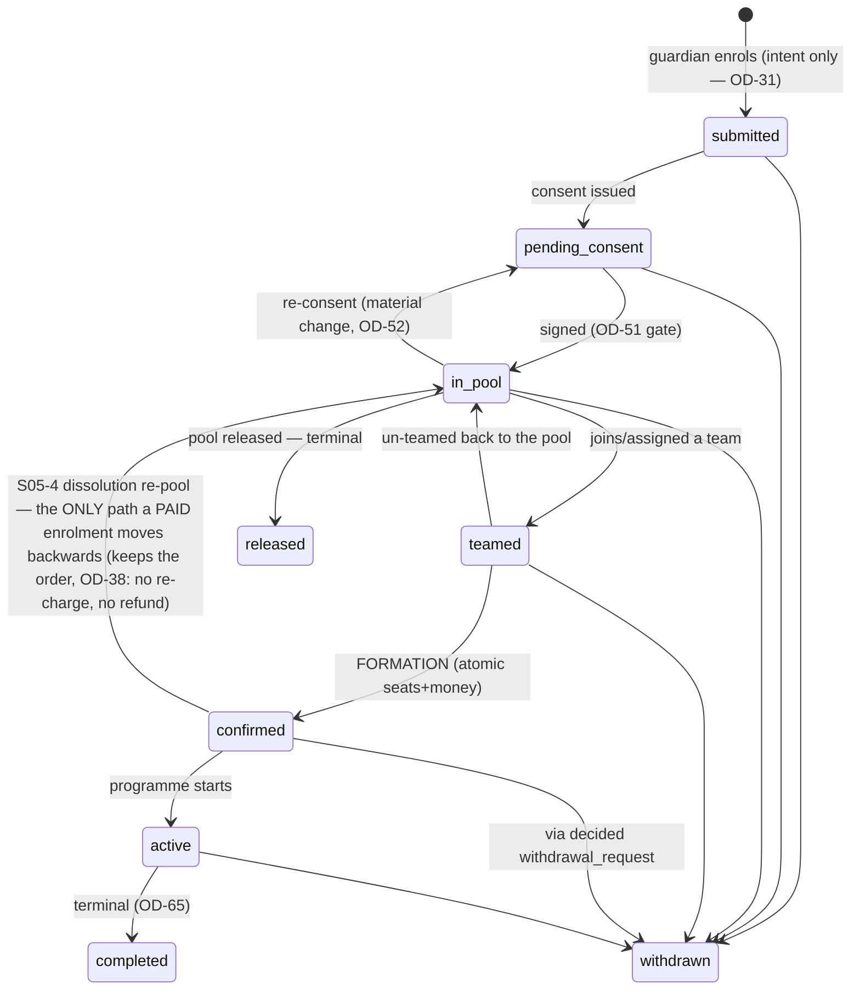
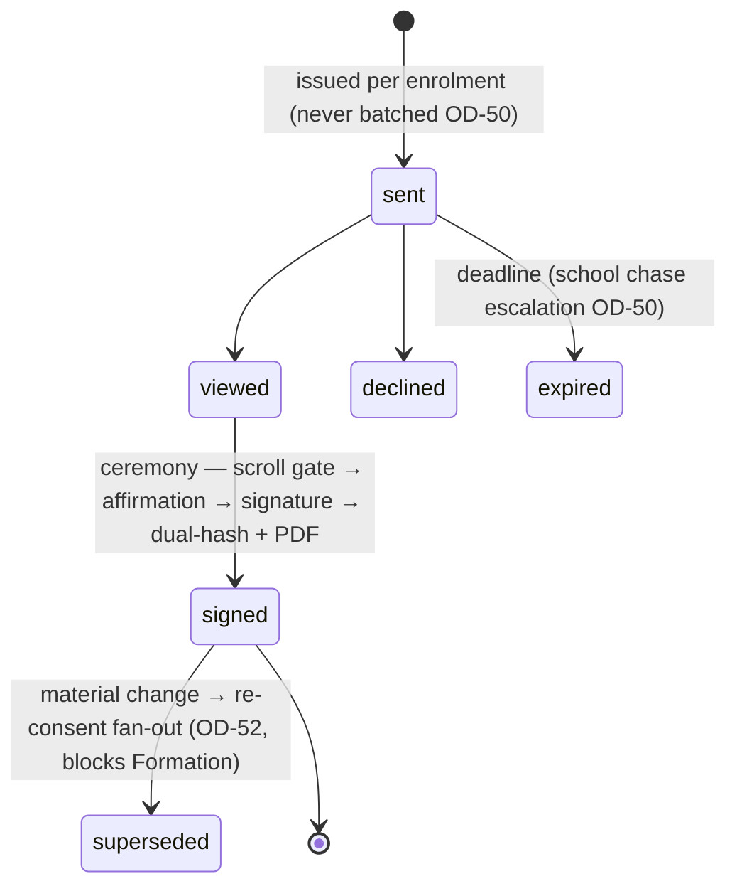
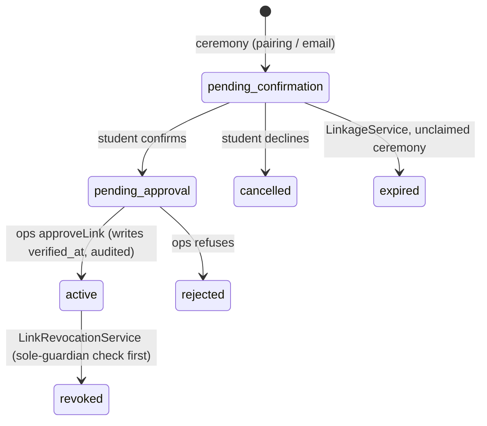
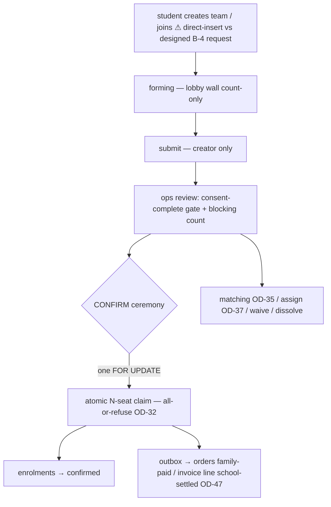
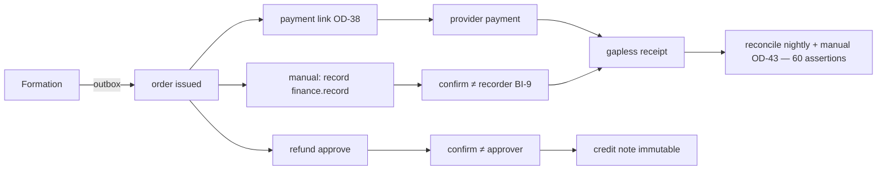

# KAP — DATA ATLAS (Document 1B)
### Full ER · per-entity schema · relationship map · workflow maps · closed loops
Companion to KAP-SYSTEM-REFERENCE.md · 20 Aug 2026 · derived from the migration source in `api/database/migrations/` (86 `Schema::create` tables) + the RLS policy source. Diagrams are Mermaid (text — readable by CC and rendered by GitHub).

**Honesty rule:** many columns in this repo are added via raw `DB::statement` after `Schema::create`, so a per-column listing here can under-count. Field lists below carry the MEANING-BEARING columns (states, FKs, guards, money); `api/database/migrations/` remains the byte-level authority. Status enums quoted from their `CHECK` constraints where read; anything marked ◇ = verify against the migration at audit time.

---

## 1 · ER OVERVIEW — the eight domains and their spine

Everything hangs off four spine objects: **users** (identity) → **enrolments** (intent) → **teams** (allocation) → **orders** (money). Consent gates the enrolment→team edge; Formation is the single moment the team→order edge fires.

---

## 2 · PER-ENTITY SCHEMA, by domain

### 2A · Identity & access (19 tables)
| Table | Meaning-bearing fields | Guards / policies |
|---|---|---|
| **users** | uuid id · role (single, one of 6) · email · verified_at · locale | one role forever (OD-1); `users_read`: own row + staff scopes + school roll for edge roles — **students read only their own row** (this is why the lobby wall is count-only). ⚠ stale guardian-create arm in `users_insert` (X-2) |
| **roles / permissions / role_permissions / capability_permissions / admin_capabilities** | the seeded matrix (Doc 1 §2.1 verbatim) | nightly reconciliation probe DB↔`permission-matrix.php`; `capabilities.grant` audited |
| **invitations** | single-use sha256 token · 14-day expiry · target role | Member invites gated by OD-22; second accept 422 |
| **registration_requests / onboarding_exceptions** | self-register → THE approval queue (S04C) · school-verification holding state (OD-28) | provenance assertion `account.provenance` |
| **guardian_links** | status CHECK permits NINE: written — ceremony → `pending_confirmation` → `pending_approval` → `active` \| `rejected` (admin) \| `cancelled` (student decline) \| `expired` (`LinkageService:210`) \| **`revoked`** (`LinkRevocationService:67`); permitted but NEVER written — `requested`, `superseded` · origin · **permission_overrides jsonb** (deny-only trigger) | self-activation retired (S04D); `approveLink` writes verified_at; `no_active_without_approval` assertion |
| **pairing_codes / pairing_code_failures** | the child-pairing ceremony; failure counting (anti-DoS question raised S04C) | codes hashed; hard-invalidate threshold |
| **held_links / link_visibility_events** | quarantined links · OD-24 visibility trail | greenfield, `scope.public_context_confinement` |
| **school_links / school_admin_links / teacher_links** | roll membership · admin anchoring · school-stamped single-school teacher (OD-54), offboarding-guarded | vouch (OD-30) writes school_links |
| **mentors** ◇ | mentor registry rows | check shape at audit |
| **guardian_replacement_exceptions** | the guardian-continuity edge case (2.2) | |

### 2B · Delegation (A-2)
| Table | Fields | Notes |
|---|---|---|
| **school_authority_grants** | school × programme(nullable=all) × capability · granted_by/at | validated against `delegable-capabilities.php`; grant/revoke/refusal all audited |
| **programme_authority_overrides** | per-programme WITHHOLD rows | withhold wins per-programme in the A-4 arms; ⚠ X-3: a school cannot read the all-schools rows affecting it |

### 2C · Programme & config (13 tables)
| Table | Fields | Guards |
|---|---|---|
| **programmes** | status (draft→published, version-snapshotted) · enrolment_opens/closes_at · **starts_at** (written by `WizardService::syncBasicsDates`, mirrored from `basics.starts_on` at basics-save AND publish, HKT midnight → UTC; FIX-REFUND-SEED) · **ends_at** (exists, still writerless — no `basics.ends_on` anywhere; AUDIT-2 A-1) · banner_upload_id · **mentor_team_access bool** (S-MENTOR-1; ⚠ X-4 column-vs-override duality) · trilingual names | **NO RLS** — globally readable reference table (this is what made the P-HYGIENE-1 direct arm work and the category arm diverge) |
| **programme_versions / wizard_sections / pre_flight_results** | hub-and-spoke wizard: sections, readiness counts, publish preflight (consent template + fees required), locked-section audit | J-19 UI unbuilt |
| **programme_capacity** | team-based capacity (OD-31) | **not family-readable**; consumed only at Formation's FOR UPDATE claim |
| **fee_items** | trilingual, versioned at publish | snapshot into order_lines |
| **withdrawal_policies / withdrawal_bands** | banded refund % · DB-validated (no overlap, ordered, in-window, 0–100) | band shown at decision + in mWd ceremony |
| **consent_templates / consent_template_versions** | trilingual body · version stamp · material-change flag | re-consent fan-out (OD-52) marks `superseded` |
| **team_categories** | lobby: programme_id · school_id nullable (open vs school-bound) | UNIQUE(id, programme_id) pending (finding-a card) |
| **role_library** | tenure role catalogue (Team Lead etc.) — programme CONFIG, created in `2026_07_25_100000_create_programme_config_tables.php` (it is not a delegation table) | feeds `tenures` |
| **certification_rules / badge_rules** | recognition config (exists — J-15 smaller than ranked) | issuance ledger 🔴 |

### 2D · Journey (17 tables)
| Table | Fields / states | Guards |
|---|---|---|
| **enrolments** | status CHECK: `submitted \| pending_consent \| in_pool \| teamed \| confirmed \| active \| completed \| withdrawn \| released` — pool is a STATE (OD-34); `released` real terminal (`EnrolmentService:25`) | `enr_read`: family own + school roll + opsAudit (audit_read arm load-bearing via `/reports/enrolment-pool` — comment at 255ca2e); detail read = index narrowed by id, 404 (S-READ-1) |
| **enrolment_batches / enrolment_batch_rows** | CSV intake → per-row dispositions → commit | school-scoped elevation; batch failure = one aging exception (OD-49) |
| **consent_requests** | status default `sent`; full set: draft·sent·viewed·signed·declined·expired·**superseded**·**voided** (`2026_07_25_150000`, used by `POST /admin/consent-requests/{id}/void`) · merge_data jsonb · **event_sequence jsonb** (the timeline) · **no `kind`** 🔴 P-1 (media consent) | never batched (OD-50); fresh per cohort (OD-53); completeness gates Formation (OD-51) |
| **consent_documents / consent_signatures** | rendered doc (upload, scanned) · sha-256 dual-hash · signature evidence | BI-6; guardian-only sign (capability_forbidden) |
| **teams** | status: `forming → submitted → confirmed` (+ dissolve path) · category_id · programme_id · created_by (= submit authority) · **no intro/visibility** 🔴 B-1 | `teams_read` arms: system·opsAudit·memberOf·lobbySchoolAdmin·lobbyWall(forming+enrolled+lobby-school)·mentor(direct, flag-gated)·A-4 delegated; pin f28e2e86 |
| **team_members** | status (`active`, ≠removed) · category_id denorm · **programme_id incoming (P-HYGIENE-1)** | `tm_read`: own row + children + school-admin-of-lobby + mentor arm; roster to members via **allowlisted elevation** (names+role+count; contacts WITHHELD); formed-team write exclusivity = service-layer (F-5 carve-out 🔴) |
| **team_teacher_links** | active mentor link; gate authority prerequisite (OD-61) | read: own link row |
| **tenures** | role ledger (role_library) | **no mentor arm** (secondary finding) |
| **stage_gates** | 5 fixed stages · status default `passed` (passes only — absence = pending) · approver_kind · approved_at · **notes withheld from family read** · category_id denorm · programme_id incoming | tracker read widened S-TRACKER-1 (`passed_at`+`approver_kind`; identity+notes never selected); **no sequence lock** (D-7) |
| **stage_requirements** | **empty shell** — 0 of 7 requirement types modelled 🔴 | the Tracker's 12-item blocker map |
| **programme_sessions / session_versions** (NB: the `sessions` table is Laravel's session-driver INFRA, created with `users`, not a journey table) | lifecycle + versioning · programme_id served (S-READ-1) | J-20 admin UI unbuilt |
| **session_bookings** | `booked \| waitlisted \| cancelled \| attended \| no_show` — session-level waitlist auto-promotes | withdrawal cascade cancels future + promotes |
| **assessments** | ONE status CHECK: `draft \| published \| open \| closed \| graded \| released \| cancelled` — `released` is a STATUS VALUE, not a flag · **no rubric / max_score / released_at** 🔴 | release irreversible (danger ceremony); embargo at the read: family sees released only, `graded` byte-identical to `published`, unreleased never probed |
| **assessment_results** | score · graded_by/at | A-4 delegated arm exists (assessments domain) |

### 2E · Money (12 tables)
| Table | Fields | Guards |
|---|---|---|
| **orders** | payer_party — `ord_payer_check` = `guardian \| student \| school` (THREE values; ◇ resolved), with `ord_school_payer_check` tying `school` to a non-null payer_school_id · status default `issued` (paid·covered_by_invoice·refunded·cancelled) · HKD | issued at Formation via outbox, never at enrolment (OD-31); **amounts reach students via `orders_read`** ⚠ P-3/B-18 — UI restraint only |
| **order_lines** | INSERT-only trilingual snapshots | immutable by policy |
| **payments** | origin (provider/manual) · provider/provider_ref · via_link · status | manual = BI-9: recorder ≠ confirmer (app + DB WITH CHECK) |
| **payment_links** | token-resolved server-side · initials-only · expiring · dead-once-paid (OD-38) | `payment_links.no_pii` assertion; no anonymous RLS policy |
| **payment_evidence / payment_obligations** | evidence uploads at confirm · the Formation outbox rows | outbox = the transactional trigger (OD-32) |
| **receipts / receipt_sequences** | gapless numbering | sequence table enforces gaplessness |
| **refunds** | destination_party · status `requested→approved→confirmed \| rejected` · `rf_update` WITH CHECK: approver ≠ confirmer on confirm; **rejected arm unguarded BY DESIGN** (P0-SAFE-3) | full-refund-only; evidence_note |
| **credit_notes** | immutable, system-insert-only | school-settled withdrawal always credit-notes (OD-48) |
| **consolidated_invoices** | school × window · aging states | OD-25/47; balance assertion |
| **reconciliation_log** | nightly + manual (OD-43) runs; 60 assertions | the reconcile gate |

### 2F · Team-project finance (S07, 6 tables)
team_budgets · budget_categories · budget_lines · team_transactions (**SoD CHECK constraint** — the fraud control) · team_fundraising · team_exceptions. Record-only overspend; charity no-distribution enforced. Backend ✅, UI out of v1 family scope.

### 2G · Community & trail
events · event_rsvps · member_profiles (adults only; `authz.member_directory_exclusive`) — and **audit_events** (immutable, BI-8 insert-from-any-context, before/after images, system actor for jobs OD-58) · **uploads** (scan pipeline pending→clean/quarantined, BI-1/BI-10; consent PDFs classified; banners via clean-upload derivation). Infra: jobs/cache/tokens (not domain).

**Absent entirely (the build's negative space):** incident_notes ⚠ · mentor_checkins · session_materials · attendance_amendments · notifications · invite codes · join_requests · team_change_requests · merge_requests · period_locks · programme-level waitlist · run-term on programmes · rubric.

---

## 3 · RELATIONSHIP MAP — roles onto entities

Constraint edges the diagram can't carry: guardian may never reach another family (RLS per-card proven) · teacher links to the TEAM never students · school never signs, never records money · ops/audit/super reach-all via opsAudit arms · finance sees the child's NAME via AD-2 elevation ⚠ D-3 · every cross-boundary read is either an RLS arm or a registered elevation with a WITHHELD list — nothing else.

---

## 4 · WORKFLOW MAPS

### 4.1 Enrolment lifecycle (the spine)

### 4.2 Consent

### 4.3 Guardian link

The CHECK permits nine values. Drawn above are the seven that are WRITTEN. `requested` and
`superseded` are permitted by the constraint and written by nothing — no transition rules govern
them, which is itself the finding (AUDIT-2 B-5).

### 4.4 Team Formation (the allocation moment)

### 4.5 Delivery & tracker
booking (capacity + session waitlist) → attendance (mentor marks ⚠ toggle; prototype wants tri-state Present/No-show/Partial) → Learn gate consumes attendance (S06-4) → gate pass (linked mentor or academy, OD-39/55; pass recorded, **no sequence lock**) → withdrawal cascade cancels future bookings + promotes waitlist.

### 4.6 Money — family-paid

School-settled variant: invoice at Formation → `covered_by_invoice` → school remits (⚠ D-6: who declares — gua-pay's "I've paid" vs sch-bill's "Mark remitted"; B-17 says school) → receipt; withdrawal ⇒ credit note always (OD-48).

### 4.7 Withdrawal
guardian requests 🔴UI → school endorses (pastoral, non-authoritative OD-26) 🔴UI → ops decides ✅ (refund-window band as evidence) → cascade ✅ (bookings, waitlist, money per band; school-settled → credit note). Duplicate idempotent · decided final · conflicting guardian cancel referred never executed.

---

## 5 · CLOSED LOOPS — the EIGHT, traced end to end, with the open edge marked

**Money loop** ✅ CLOSED: order → payment (provider or BI-9 pair) → gapless receipt → nightly reconcile (60 assertions) → Financial Integrity surface → audit trail. Open edges: period_locks 🔴 (P-8, post-close mutation possible) · aging UI 🔴.

**Consent loop** 🟡: template version → issue → ceremony → dual-hash evidence + PDF → audit certificate (aud-consent ✅) → material change → supersede → re-issue → re-sign → Formation gate re-checks. Open edges: D1 revocation (mRevoke drawn, unbuilt) · media-consent `kind` 🔴 · student's own read P-4 🔴.

**Formation loop** ✅ CLOSED at the transaction: consent gate → seat claim → status flip → money fire — all one transaction, twin-team race proven. Open edges: join-request grammar (B-4) upstream · formed-team change requests (C-1/C-2) downstream — both DU.

**Withdrawal loop** 🟡: request → endorse → decide → cascade → refund/credit-note → receipt-chain balance assertion. Open edges: both edge-role UIs 🔴 · cancel-pending (J-17) 🔴.

**Audit loop** ✅ CLOSED: every mutation (incl. scheduled jobs via system actor) → immutable event with before/after → explorer + evidence surfaces → reports (enrolment-pool proves the read arm). Open edge: export 🔴.

**Delegation loop** 🔴 OPEN — the biggest: grant (A-2, audited) → resolve (A-3) → enforce (A-4, 3 of 7 domains) → **but never surfaced**: `/me` doesn't carry it (S-1), no delegation-config screen, X-3 blinds the school to all-schools withholds, and D-5's coarse vocabulary caps what can be granted at all. The loop exists below the waterline only.

**Recognition loop** 🔴 OPEN: rules configured → nothing mints → nothing displays (J-15, v2).

**Notification loop** 🔴 ABSENT — and the prototype has drawn its whole contract (typed items per persona, snooze with re-arm, never-mute safety class): the single missing domain touched by six affordances across four personas.

---

*Audit use: CC verifies build claims against §2 field/guard rows and §4–5 shapes; where this atlas and a migration disagree, the migration wins and the atlas gets corrected — same rule as every derived document.*
